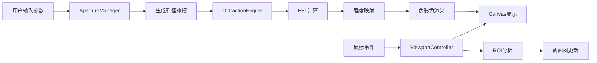

# 衍射仿真软件 - 完整技术方案文档

> **文档版本**: 1.0.0  
> **创建日期**: 2026-05-01  
> **适用平台**: Windows / macOS / Linux  
> **目标用户**: 物理学研究者、光学工程师、教育工作者  

---

## 📋 目录

1. [项目概述](#1-项目概述)
2. [系统架构](#2-系统架构)
3. [技术栈详解](#3-技术栈详解)
4. [核心模块设计](#4-核心模块设计)
5. [数据结构定义](#5-数据结构定义)
6. [API接口规范](#6-api接口规范)
7. [GUI设计方案](#7-gui设计方案)
8. [实现路线图](#8-实现路线图)
9. [部署与打包](#9-部署与打包)
10. [测试策略](#10-测试策略)

---

## 1. 项目概述

### 1.1 项目目标

开发一款高度可定制的衍射仿真软件，支持：
- 多种孔径形状的自由定义与组合
- 实时参数调整与衍射图样即时更新
- 无极缩放与高性能渲染
- 专业级定量分析工具

### 1.2 核心功能清单

| 功能模块 | 优先级 | 描述 |
|---------|--------|------|
| 孔径定义系统 | P0 | 预设形状 + 自定义编辑器 |
| 衍射计算引擎 | P0 | 夫琅和费/菲涅尔传播模型 |
| 实时渲染 | P0 | GPU加速，>30fps @ 1024x1024 |
| 无极缩放 | P1 | 鼠标滚轮平滑缩放 |
| 参数调节面板 | P0 | 波长、孔径尺寸、距离等 |
| 截面分析 | P1 | 任意直线强度分布 |
| 多波长合成 | P2 | RGB白光衍射模拟 |
| 批处理 | P2 | 参数扫描与动画输出 |

---

## 2. 系统架构

### 2.1 整体架构图

```
┌─────────────────────────────────────────────────┐
│                   GUI Layer                      │
│  ┌──────────┐  ┌──────────┐  ┌──────────────┐  │
│  │ Main     │  │ Control  │  │ Visualization│  │
│  │ Window   │  │ Panels   │  │ Canvas       │  │
│  └──────────┘  └──────────┘  └──────────────┘  │
├─────────────────────────────────────────────────┤
│               Application Layer                  │
│  ┌──────────┐  ┌──────────┐  ┌──────────────┐  │
│  │ Aperture │  │ Diffract │  │ Analysis     │  │
│  │ Manager  │  │ Engine   │  │ Tools        │  │
│  └──────────┘  └──────────┘  └──────────────┘  │
├─────────────────────────────────────────────────┤
│                  Core Layer                      │
│  ┌──────────┐  ┌──────────┐  ┌──────────────┐  │
│  │ FFT      │  │ Optical  │  │ Units &      │  │
│  │ Backend  │  │ Models   │  │ Constants    │  │
│  └──────────┘  └──────────┘  └──────────────┘  │
├─────────────────────────────────────────────────┤
│              Infrastructure Layer                │
│  ┌──────────┐  ┌──────────┐  ┌──────────────┐  │
│  │ Config   │  │ I/O      │  │ GPU Context  │  │
│  │ Manager  │  │ Handler  │  │ Manager      │  │
│  └──────────┘  └──────────┘  └──────────────┘  │
└─────────────────────────────────────────────────┘
```

### 2.2 数据流图



### 2.3 设计模式应用

| 模式 | 应用场景 |
|------|---------|
| **策略模式** | 衍射传播模型可切换（夫琅和费/菲涅尔/角谱法） |
| **工厂模式** | 孔径形状创建 |
| **观察者模式** | 参数变更通知渲染更新 |
| **命令模式** | 撤销/重做操作 |
| **单例模式** | 配置管理器、GPU上下文 |
| **MVC** | GUI-引擎-数据分离 |

---

## 3. 技术栈详解

### 3.1 依赖清单

```yaml
# requirements.txt
# 核心计算
numpy>=1.24.0
scipy>=1.10.0
cupy-cuda11x>=12.0.0  # 可选GPU加速，根据CUDA版本调整

# GUI框架
PyQt6>=6.5.0
pyqtgraph>=0.13.0     # 高性能科学可视化
vispy>=0.14.0         # GPU渲染与缩放

# 图像处理
opencv-python>=4.8.0
Pillow>=10.0.0

# 数据处理
h5py>=3.9.0           # HDF5数据存储
numba>=0.58.0         # JIT编译加速（CPU备选）

# 工具库
pydantic>=2.0.0       # 参数验证
pyyaml>=6.0           # 配置文件
tifffile>=2023.0.0    # TIFF导出

# 打包部署
pyinstaller>=6.0.0    # 打包为独立应用
```

### 3.2 技术选型理由

| 技术 | 理由 |
|------|------|
| **PyQt6** | 成熟稳定，控件丰富，原生性能，支持样式表 |
| **pyqtgraph** | 专为实时数据设计，比matplotlib快100x |
| **vispy** | 基于OpenGL，支持4K以上纹理的无极缩放 |
| **CuPy** | 与NumPy接口兼容，GPU加速FFT零成本迁移 |
| **Numba** | CPU JIT编译，无GPU时的性能备选 |

---

## 4. 核心模块设计

### 4.1 孔径定义模块 (`aperture.py`)

#### 类继承结构

```python
from abc import ABC, abstractmethod
from dataclasses import dataclass
from enum import Enum
import numpy as np

class ApertureType(Enum):
    """孔径类型枚举"""
    CIRCLE = "circle"
    RECTANGLE = "rectangle"
    TRIANGLE = "triangle"
    HEXAGON = "hexagon"
    ANNULUS = "annulus"
    POLYGON = "polygon"
    STAR = "star"
    DOUBLE_SLIT = "double_slit"
    GRATING = "grating"
    CUSTOM_SVG = "custom_svg"
    CUSTOM_BITMAP = "custom_bitmap"
    COMPOSITE = "composite"  # 布尔组合

class CompositeOperation(Enum):
    """布尔运算类型"""
    UNION = "union"
    INTERSECTION = "intersection"
    SUBTRACT = "subtract"
    XOR = "xor"

@dataclass
class ApertureParams:
    """孔径基础参数"""
    size: float            # 特征尺寸 (微米)
    center_x: float = 0.0  # 中心偏移
    center_y: float = 0.0
    rotation: float = 0.0  # 旋转角度 (度)
    
class BaseAperture(ABC):
    """孔径基类"""
    
    def __init__(self, params: ApertureParams):
        self.params = params
        self._mask_cache = None
        self._cache_grid_size = None
    
    @abstractmethod
    def generate_mask(self, x_grid: np.ndarray, y_grid: np.ndarray) -> np.ndarray:
        """
        生成二值掩模
        Args:
            x_grid: x坐标网格 (米)
            y_grid: y坐标网格 (米)
        Returns:
            mask: 二值数组，1表示透光，0表示不透光
        """
        pass
    
    def get_mask(self, x_grid: np.ndarray, y_grid: np.ndarray) -> np.ndarray:
        """带缓存的掩模获取"""
        grid_size = (x_grid.shape, tuple(x_grid.flatten()[:3]))
        if self._mask_cache is not None and self._cache_grid_size == grid_size:
            return self._mask_cache
        mask = self.generate_mask(x_grid, y_grid)
        self._mask_cache = mask
        self._cache_grid_size = grid_size
        return mask
    
    def clear_cache(self):
        """清除缓存（参数变更时调用）"""
        self._mask_cache = None
        self._cache_grid_size = None

class CircleAperture(BaseAperture):
    """圆形孔径"""
    
    def generate_mask(self, x_grid, y_grid):
        radius = self.params.size / 2 * 1e-6  # 转换为米
        cx = self.params.center_x * 1e-6
        cy = self.params.center_y * 1e-6
        r = np.sqrt((x_grid - cx)**2 + (y_grid - cy)**2)
        return (r <= radius).astype(np.float32)

class RectangleAperture(BaseAperture):
    """矩形孔径"""
    
    def __init__(self, params: ApertureParams, aspect_ratio: float = 1.0):
        super().__init__(params)
        self.aspect_ratio = aspect_ratio
    
    def generate_mask(self, x_grid, y_grid):
        width = self.params.size * 1e-6
        height = self.params.size * self.aspect_ratio * 1e-6
        cx = self.params.center_x * 1e-6
        cy = self.params.center_y * 1e-6
        
        # 处理旋转
        if self.params.rotation != 0:
            theta = np.radians(self.params.rotation)
            x_rot = (x_grid - cx) * np.cos(theta) + (y_grid - cy) * np.sin(theta) + cx
            y_rot = -(x_grid - cx) * np.sin(theta) + (y_grid - cy) * np.cos(theta) + cy
        else:
            x_rot, y_rot = x_grid, y_grid
            
        mask_x = np.abs(x_rot - cx) <= width / 2
        mask_y = np.abs(y_rot - cy) <= height / 2
        return (mask_x & mask_y).astype(np.float32)

class CompositeAperture(BaseAperture):
    """组合孔径（支持布尔运算）"""
    
    def __init__(self, apertures: list, operation: CompositeOperation):
        self.apertures = apertures
        self.operation = operation
        super().__init__(ApertureParams(size=0))  # 组合孔径忽略size参数
    
    def generate_mask(self, x_grid, y_grid):
        masks = [ap.generate_mask(x_grid, y_grid) for ap in self.apertures]
        
        if self.operation == CompositeOperation.UNION:
            result = np.zeros_like(masks[0])
            for m in masks:
                result = np.logical_or(result, m)
        elif self.operation == CompositeOperation.INTERSECTION:
            result = np.ones_like(masks[0])
            for m in masks:
                result = np.logical_and(result, m)
        elif self.operation == CompositeOperation.SUBTRACT:
            result = masks[0].copy()
            for m in masks[1:]:
                result = np.logical_and(result, np.logical_not(m))
        else:  # XOR
            result = masks[0].copy()
            for m in masks[1:]:
                result = np.logical_xor(result, m)
        
        return result.astype(np.float32)

class ApertureFactory:
    """孔径工厂"""
    
    @staticmethod
    def create(aperture_type: ApertureType, **kwargs) -> BaseAperture:
        params = ApertureParams(**kwargs.get('params', {}))
        
        factory_map = {
            ApertureType.CIRCLE: lambda: CircleAperture(params),
            ApertureType.RECTANGLE: lambda: RectangleAperture(
                params, 
                aspect_ratio=kwargs.get('aspect_ratio', 1.0)
            ),
            ApertureType.ANNULUS: lambda: AnnulusAperture(
                params,
                inner_ratio=kwargs.get('inner_ratio', 0.5)
            ),
            # ... 更多形状映射
        }
        
        if aperture_type in factory_map:
            return factory_map[aperture_type]()
        raise ValueError(f"Unknown aperture type: {aperture_type}")
```

### 4.2 衍射计算引擎 (`diffraction.py`)

```python
from enum import Enum
import numpy as np
from typing import Optional, Tuple

class PropagationModel(Enum):
    """传播模型"""
    FRAUNHOFER = "fraunhofer"      # 夫琅和费（远场）
    FRESNEL_ASM = "fresnel_asm"     # 菲涅尔-角谱法
    FRESNEL_IR = "fresnel_ir"       # 菲涅尔-脉冲响应
    RAYLEIGH_SOMMERFELD = "rayleigh_sommerfeld"

@dataclass
class SimulationParams:
    """仿真参数"""
    wavelength: float = 532e-9      # 波长 (米)
    grid_size: int = 1024           # 计算网格大小
    physical_size: float = 100e-6   # 物理尺寸 (米)
    propagation_distance: float = 0.1  # 传播距离 (米)
    model: PropagationModel = PropagationModel.FRAUNHOFER
    pad_factor: float = 2.0         # 零填充因子

class DiffractionEngine:
    """衍射计算引擎"""
    
    def __init__(self, use_gpu: bool = False):
        self.use_gpu = use_gpu
        self._setup_backend()
    
    def _setup_backend(self):
        """设置计算后端"""
        if self.use_gpu:
            try:
                import cupy as cp
                self.xp = cp
                self._fft2 = cp.fft.fft2
                self._ifft2 = cp.fft.ifft2
                self._fftshift = cp.fft.fftshift
                print("[INFO] GPU backend enabled (CuPy)")
            except ImportError:
                print("[WARN] CuPy not available, falling back to CPU")
                self.use_gpu = False
                self._setup_cpu()
        else:
            self._setup_cpu()
    
    def _setup_cpu(self):
        """CPU后端（使用Numba加速）"""
        self.xp = np
        try:
            from numba import njit
            self._use_numba = True
        except ImportError:
            self._use_numba = False
        self._fft2 = np.fft.fft2
        self._ifft2 = np.fft.ifft2
        self._fftshift = np.fft.fftshift
    
    def create_grid(self, params: SimulationParams) -> Tuple[np.ndarray, np.ndarray, float]:
        """创建计算网格"""
        n = params.grid_size
        L = params.physical_size
        dx = L / n
        
        x = self.xp.linspace(-L/2, L/2 - dx, n)
        y = self.xp.linspace(-L/2, L/2 - dx, n)
        X, Y = self.xp.meshgrid(x, y)
        
        return X, Y, dx
    
    def compute_diffraction(
        self, 
        aperture: BaseAperture, 
        params: SimulationParams
    ) -> dict:
        """
        计算衍射图样
        Returns:
            dict with keys: 'intensity', 'field', 'x_freq', 'y_freq', 'dx_output'
        """
        X, Y, dx = self.create_grid(params)
        
        # 生成孔径掩模
        mask = aperture.get_mask(X, Y)
        
        # 添加零填充
        if params.pad_factor > 1:
            mask = self._zero_pad(mask, params.pad_factor)
        
        if params.model == PropagationModel.FRAUNHOFER:
            result = self._fraunhofer(mask, dx, params)
        elif params.model == PropagationModel.FRESNEL_ASM:
            result = self._fresnel_asm(mask, dx, params)
        else:
            result = self._fraunhofer(mask, dx, params)
        
        return result
    
    def _fraunhofer(self, field: np.ndarray, dx: float, params: SimulationParams) -> dict:
        """夫琅和费衍射（远场近似）"""
        N = field.shape[0]
        k = 2 * np.pi / params.wavelength
        
        # 傅里叶变换
        F = self._fftshift(self._fft2(field))
        intensity = self.xp.abs(F)**2
        
        # 频率坐标
        df = 1 / (N * dx)
        fx = self.xp.fft.fftshift(self.xp.fft.fftfreq(N, dx))
        fy = self.xp.fft.fftshift(self.xp.fft.fftfreq(N, dx))
        
        return {
            'intensity': self._to_numpy(intensity),
            'field': self._to_numpy(F),
            'x_freq': self._to_numpy(fx),
            'y_freq': self._to_numpy(fy),
            'dx_output': df
        }
    
    def _fresnel_asm(self, field: np.ndarray, dx: float, params: SimulationParams) -> dict:
        """菲涅尔衍射 - 角谱法"""
        N = field.shape[0]
        k = 2 * np.pi / params.wavelength
        z = params.propagation_distance
        
        # 频率坐标
        fx = self.xp.fft.fftfreq(N, dx)
        fy = self.xp.fft.fftfreq(N, dx)
        FX, FY = self.xp.meshgrid(fx, fy)
        
        # 角谱传播函数
        H = self.xp.exp(1j * k * z * self.xp.sqrt(
            1 - (params.wavelength * FX)**2 - (params.wavelength * FY)**2
        ))
        H[self.xp.isnan(H)] = 0
        
        # 角谱计算
        A0 = self._fft2(field)
        A1 = A0 * H
        U = self._ifft2(A1)
        
        intensity = self.xp.abs(U)**2
        
        return {
            'intensity': self._to_numpy(intensity),
            'field': self._to_numpy(U),
            'x_freq': self._to_numpy(fx),
            'y_freq': self._to_numpy(fy),
            'dx_output': dx
        }
    
    def _zero_pad(self, array: np.ndarray, factor: float) -> np.ndarray:
        """零填充以提高频率分辨率"""
        N = array.shape[0]
        pad_size = int(N * (factor - 1) / 2)
        return self.xp.pad(array, pad_size, mode='constant')
    
    def _to_numpy(self, array) -> np.ndarray:
        """安全转换为NumPy数组"""
        if hasattr(array, 'get'):  # CuPy数组
            return array.get()
        return np.asarray(array)
```

### 4.3 渲染画布模块 (`canvas.py`)

```python
import pyqtgraph as pg
from PyQt6.QtCore import Qt, QTimer
from PyQt6.QtGui import QColor
import numpy as np

class DiffractionCanvas(pg.GraphicsLayoutWidget):
    """衍射图样渲染画布"""
    
    def __init__(self, parent=None):
        super().__init__(parent)
        self._setup_view()
        self._setup_items()
        self._setup_interaction()
    
    def _setup_view(self):
        """设置视图"""
        self.view = self.addViewBox(row=0, col=0)
        self.view.setAspectLocked(True)
        self.view.setBackgroundColor(QColor(20, 20, 30))
        
        # 默认视图范围
        self.view.setRange(xRange=(-1, 1), yRange=(-1, 1))
    
    def _setup_items(self):
        """设置图像项"""
        self.image_item = pg.ImageItem()
        self.image_item.setOpts(axisOrder='row-major')
        self.view.addItem(self.image_item)
        
        # 颜色映射
        self._setup_colormap()
    
    def _setup_colormap(self):
        """设置伪彩色映射"""
        from pyqtgraph import ColorMap
        
        # 热力图颜色映射
        colors = [
            (0, 0, 0),
            (0, 0, 100),
            (0, 50, 150),
            (0, 100, 200),
            (50, 150, 255),
            (100, 200, 255),
            (150, 255, 255),
            (255, 255, 150),
            (255, 200, 50),
            (255, 100, 0),
            (255, 0, 0),
            (255, 255, 255)
        ]
        positions = np.linspace(0, 1, len(colors))
        color_map = ColorMap(positions, colors)
        self.image_item.setLookupTable(color_map.getLookupTable())
    
    def _setup_interaction(self):
        """设置交互"""
        # 鼠标移动显示坐标和强度值
        self.scene().sigMouseMoved.connect(self._on_mouse_moved)
        
        # 添加十字准线
        self.crosshair_v = pg.InfiniteLine(angle=90, movable=False, 
                                           pen=pg.mkPen('w', width=1, style=Qt.PenStyle.DashLine))
        self.crosshair_h = pg.InfiniteLine(angle=0, movable=False,
                                           pen=pg.mkPen('w', width=1, style=Qt.PenStyle.DashLine))
        self.view.addItem(self.crosshair_v, ignoreBounds=True)
        self.view.addItem(self.crosshair_h, ignoreBounds=True)
    
    def update_diffraction(self, intensity: np.ndarray, x_freq: np.ndarray, y_freq: np.ndarray):
        """更新衍射图样"""
        # 对数缩放增强对比度
        intensity_log = np.log1p(intensity)
        intensity_log = self._normalize(intensity_log)
        
        # 设置图像
        rect = [
            x_freq[0], y_freq[0],
            x_freq[-1] - x_freq[0], y_freq[-1] - y_freq[0]
        ]
        self.image_item.setImage(intensity_log.T, rect=rect, autoLevels=False)
        
        # 自动调整级别
        self.image_item.setLevels([0, intensity_log.max() * 0.8])
    
    def _normalize(self, data: np.ndarray) -> np.ndarray:
        """归一化到0-1"""
        data_min = data.min()
        data_max = data.max()
        if data_max > data_min:
            return (data - data_min) / (data_max - data_min)
        return data
    
    def _on_mouse_moved(self, pos):
        """鼠标移动事件"""
        if self.image_item.image is not None:
            mouse_point = self.view.mapSceneToView(pos)
            # 获取像素值（需要实现坐标转换）
            self.crosshair_v.setPos(mouse_point.x())
            self.crosshair_h.setPos(mouse_point.y())
    
    def set_colormap(self, colormap_name: str):
        """切换颜色映射"""
        colormaps = {
            'hot': self._setup_colormap,
            'viridis': self._setup_viridis_colormap,
            'gray': self._setup_gray_colormap,
        }
        if colormap_name in colormaps:
            colormaps[colormap_name]()
```

### 4.4 主窗口 (`main_window.py`)

```python
from PyQt6.QtWidgets import (
    QMainWindow, QWidget, QVBoxLayout, QHBoxLayout,
    QDockWidget, QMenuBar, QToolBar, QStatusBar,
    QPushButton, QLabel, QComboBox, QDoubleSpinBox,
    QGroupBox, QFormLayout, QSlider
)
from PyQt6.QtCore import Qt, pyqtSignal
from PyQt6.QtGui import QAction, QKeySequence

class MainWindow(QMainWindow):
    """主窗口"""
    
    # 信号定义
    params_changed = pyqtSignal(dict)
    
    def __init__(self):
        super().__init__()
        self.setWindowTitle("衍射仿真软件 - DiffractionLab")
        self.setMinimumSize(1200, 800)
        
        self._setup_ui()
        self._setup_menu()
        self._setup_toolbar()
        self._setup_statusbar()
        self._connect_signals()
        
        # 应用暗色主题
        self._apply_theme()
    
    def _setup_ui(self):
        """设置UI布局"""
        # 中央组件 - 渲染画布
        self.canvas = DiffractionCanvas()
        self.setCentralWidget(self.canvas)
        
        # 右侧控制面板
        self.control_panel = ControlPanel()
        dock = QDockWidget("参数控制", self)
        dock.setWidget(self.control_panel)
        dock.setFeatures(QDockWidget.DockWidgetFeature.DockWidgetMovable |
                        QDockWidget.DockWidgetFeature.DockWidgetFloatable)
        self.addDockWidget(Qt.DockWidgetArea.RightDockWidgetArea, dock)
        
        # 底部截面图
        self.profile_plot = ProfilePlot()
        dock_bottom = QDockWidget("截面分析", self)
        dock_bottom.setWidget(self.profile_plot)
        self.addDockWidget(Qt.DockWidgetArea.BottomDockWidgetArea, dock_bottom)
    
    def _setup_menu(self):
        """设置菜单栏"""
        menubar = self.menuBar()
        
        # 文件菜单
        file_menu = menubar.addMenu("文件")
        file_menu.addAction("打开配置...", self._load_config, QKeySequence.StandardKey.Open)
        file_menu.addAction("保存配置...", self._save_config, QKeySequence.StandardKey.Save)
        file_menu.addSeparator()
        file_menu.addAction("导出图像...", self._export_image, "Ctrl+E")
        file_menu.addAction("导出数据...", self._export_data, "Ctrl+D")
        file_menu.addSeparator()
        file_menu.addAction("退出", self.close, QKeySequence.StandardKey.Quit)
        
        # 视图菜单
        view_menu = menubar.addMenu("视图")
        view_menu.addAction("重置视图", self._reset_view, "R")
        view_menu.addAction("适应窗口", self._fit_to_window, "F")
        view_menu.addSeparator()
        
        # 颜色映射子菜单
        colormap_menu = view_menu.addMenu("颜色映射")
        for cmap in ['热力图', '翠绿色', '灰度', '等离子体']:
            colormap_menu.addAction(cmap, lambda c=cmap: self._set_colormap(c))
        
        # 分析菜单
        analysis_menu = menubar.addMenu("分析")
        analysis_menu.addAction("添加截面线", self._add_profile_line, "L")
        analysis_menu.addAction("测量工具", self._toggle_measure_tool, "M")
        analysis_menu.addSeparator()
        analysis_menu.addAction("参数扫描...", self._parameter_scan)
        
        # 帮助菜单
        help_menu = menubar.addMenu("帮助")
        help_menu.addAction("使用指南", self._show_help, "F1")
        help_menu.addAction("关于", self._show_about)
    
    def _setup_toolbar(self):
        """设置工具栏"""
        toolbar = QToolBar("主工具栏")
        self.addToolBar(toolbar)
        
        # 孔径选择
        aperture_label = QLabel("孔径: ")
        toolbar.addWidget(aperture_label)
        self.aperture_combo = QComboBox()
        self.aperture_combo.addItems([
            "圆形", "矩形", "三角形", "六边形", 
            "圆环", "双缝", "光栅", "自定义..."
        ])
        toolbar.addWidget(self.aperture_combo)
        
        toolbar.addSeparator()
        
        # 快速预设按钮
        for name, desc in [("艾里斑", "圆形标准测试"), 
                           ("双缝干涉", "杨氏实验")]:
            btn = QPushButton(name)
            btn.setToolTip(desc)
            toolbar.addWidget(btn)
    
    def _setup_statusbar(self):
        """设置状态栏"""
        self.statusbar = QStatusBar()
        self.setStatusBar(self.statusbar)
        
        self.status_coord = QLabel("坐标: --")
        self.status_intensity = QLabel("强度: --")
        self.status_fps = QLabel("FPS: --")
        self.status_backend = QLabel("后端: CPU")
        
        for widget in [self.status_coord, self.status_intensity, 
                       self.status_fps, self.status_backend]:
            self.statusbar.addPermanentWidget(widget)
    
    def _connect_signals(self):
        """连接信号"""
        self.control_panel.params_changed.connect(self._on_params_changed)
        self.aperture_combo.currentTextChanged.connect(self._on_aperture_changed)
        self.canvas.mouse_moved.connect(self._update_statusbar)
```

### 4.5 控制面板 (`controls.py`)

```python
class ControlPanel(QWidget):
    """参数控制面板"""
    
    params_changed = pyqtSignal(dict)
    
    def __init__(self, parent=None):
        super().__init__(parent)
        self._setup_ui()
    
    def _setup_ui(self):
        layout = QVBoxLayout(self)
        
        # 光学参数组
        optical_group = QGroupBox("光学参数")
        optical_form = QFormLayout()
        
        self.wavelength_spin = QDoubleSpinBox()
        self.wavelength_spin.setRange(200, 2000)
        self.wavelength_spin.setValue(532)
        self.wavelength_spin.setSuffix(" nm")
        self.wavelength_spin.setDecimals(1)
        optical_form.addRow("波长:", self.wavelength_spin)
        
        self.size_spin = QDoubleSpinBox()
        self.size_spin.setRange(0.1, 1000)
        self.size_spin.setValue(50)
        self.size_spin.setSuffix(" μm")
        optical_form.addRow("孔径尺寸:", self.size_spin)
        
        self.distance_spin = QDoubleSpinBox()
        self.distance_spin.setRange(0.01, 10)
        self.distance_spin.setValue(0.1)
        self.distance_spin.setSuffix(" m")
        optical_form.addRow("传播距离:", self.distance_spin)
        
        optical_group.setLayout(optical_form)
        layout.addWidget(optical_group)
        
        # 计算参数组
        compute_group = QGroupBox("计算参数")
        compute_form = QFormLayout()
        
        self.grid_combo = QComboBox()
        self.grid_combo.addItems(["512", "1024", "2048", "4096"])
        self.grid_combo.setCurrentText("1024")
        compute_form.addRow("网格大小:", self.grid_combo)
        
        self.model_combo = QComboBox()
        self.model_combo.addItems([
            "夫琅和费 (远场)", 
            "菲涅尔 (角谱法)"
        ])
        compute_form.addRow("传播模型:", self.model_combo)
        
        compute_group.setLayout(compute_form)
        layout.addWidget(compute_group)
        
        # 显示参数组
        display_group = QGroupBox("显示参数")
        display_form = QFormLayout()
        
        self.gamma_slider = QSlider(Qt.Orientation.Horizontal)
        self.gamma_slider.setRange(10, 300)
        self.gamma_slider.setValue(100)
        display_form.addRow("对比度:", self.gamma_slider)
        
        self.log_check = QCheckBox("对数显示")
        self.log_check.setChecked(True)
        display_form.addRow("", self.log_check)
        
        display_group.setLayout(display_form)
        layout.addWidget(display_group)
        
        # 更新按钮
        self.update_btn = QPushButton("更新计算")
        self.update_btn.clicked.connect(self._emit_params)
        layout.addWidget(self.update_btn)
        
        layout.addStretch()
    
    def _emit_params(self):
        """发射参数变更信号"""
        params = {
            'wavelength': self.wavelength_spin.value() * 1e-9,
            'aperture_size': self.size_spin.value() * 1e-6,
            'distance': self.distance_spin.value(),
            'grid_size': int(self.grid_combo.currentText()),
            'model': self.model_combo.currentText(),
            'gamma': self.gamma_slider.value() / 100,
            'log_scale': self.log_check.isChecked()
        }
        self.params_changed.emit(params)
    
    def get_params(self) -> dict:
        """获取当前所有参数"""
        self._emit_params()  # 触发一次获取
        # 实际实现中应返回存储的参数字典
```

---

## 5. 数据结构定义

### 5.1 配置文件格式 (YAML)

```yaml
# config/default_config.yaml
simulation:
  wavelength: 532e-9  # 波长 (米)
  grid_size: 1024
  physical_size: 200e-6
  propagation_distance: 0.1
  pad_factor: 2.0
  model: "fraunhofer"

aperture:
  type: "circle"
  params:
    size: 50  # 微米
    center_x: 0
    center_y: 0
    rotation: 0

display:
  colormap: "hot"
  log_scale: true
  gamma: 1.0
  auto_levels: true

analysis:
  cross_section:
    enabled: false
    angle: 0  # 度
    width: 5  # 像素

export:
  dpi: 300
  format: "tiff"
  include_metadata: true
```

### 5.2 项目文件结构

```
diffraction_lab/
├── src/
│   ├── __init__.py
│   ├── main.py                    # 入口文件
│   ├── core/
│   │   ├── __init__.py
│   │   ├── aperture.py            # 孔径定义
│   │   ├── diffraction.py         # 衍射引擎
│   │   ├── optics.py              # 光学常数与工具函数
│   │   └── units.py               # 单位转换
│   ├── gui/
│   │   ├── __init__.py
│   │   ├── main_window.py         # 主窗口
│   │   ├── canvas.py              # 渲染画布
│   │   ├── control_panel.py       # 控制面板
│   │   ├── shape_editor.py        # 孔径编辑器
│   │   ├── profile_plot.py        # 截面分析图
│   │   ├── colormaps.py           # 颜色映射
│   │   └── dialogs/
│   │       ├── __init__.py
│   │       ├── export_dialog.py
│   │       ├── parameter_scan_dialog.py
│   │       └── about_dialog.py
│   ├── analysis/
│   │   ├── __init__.py
│   │   ├── measurements.py        # 测量工具
│   │   └── fitting.py             # 曲线拟合
│   └── utils/
│       ├── __init__.py
│       ├── config.py              # 配置管理
│       ├── io_handler.py          # 文件I/O
│       └── logger.py              # 日志
├── assets/
│   ├── icons/
│   └── colormaps/
├── config/
│   └── default_config.yaml
├── tests/
│   ├── test_aperture.py
│   ├── test_diffraction.py
│   └── test_gui.py
├── docs/
│   └── user_guide.md
├── requirements.txt
├── setup.py
└── README.md
```

---

## 6. API接口规范

### 6.1 内部API

```python
# 主要接口函数签名

def compute_diffraction(
    aperture: BaseAperture,
    wavelength: float,
    grid_size: int = 1024,
    physical_size: float = 100e-6,
    model: str = 'fraunhofer',
    **kwargs
) -> DiffractionResult:
    """
    计算衍射图样
    
    Parameters:
    -----------
    aperture : BaseAperture
        孔径对象
    wavelength : float
        波长 (米)
    grid_size : int
        计算网格大小
    physical_size : float
        物理尺寸 (米)
    model : str
        传播模型: 'fraunhofer', 'fresnel_asm', 'fresnel_ir'
    
    Returns:
    --------
    DiffractionResult
        包含强度图、频率坐标等
    """
    pass

@dataclass
class DiffractionResult:
    """衍射计算结果"""
    intensity: np.ndarray          # 强度分布 [grid_size x grid_size]
    field: np.ndarray              # 复振幅 [grid_size x grid_size]
    x_freq: np.ndarray             # x方向空间频率
    y_freq: np.ndarray             # y方向空间频率
    dx_output: float               # 输出空间分辨率
    metadata: dict                 # 计算元数据
    
    def get_cross_section(self, angle: float = 0, 
                          center: tuple = None) -> np.ndarray:
        """提取指定角度的截面"""

def create_aperture(
    aperture_type: str,
    size: float,
    **kwargs
) -> BaseAperture:
    """创建孔径实例"""
```

### 6.2 CLI接口

```bash
# 命令行调用示例
python -m diffraction_lab --config config.yaml --export result.tiff

python -m diffraction_lab --cli \
    --aperture circle --size 50 \
    --wavelength 532 --grid 2048 \
    --output result.h5
```

---

## 7. GUI设计方案

### 7.1 窗口布局

```
┌─────────────────────────────────────────────────────────┐
│ Menu Bar (File | View | Analysis | Help)                │
├─────────────────────────────────────────────────────────┤
│ Tool Bar (孔径选择 | 快速预设 | 测量工具)                │
├───────────────────────┬─────────────────────────────────┤
│                       │  Control Panel                  │
│                       │  ┌─────────────────────────┐    │
│    Diffraction        │  │ 光学参数                │    │
│    Canvas             │  │  波长: [532 nm] ▾      │    │
│    (pyqtgraph/vispy)  │  │  尺寸: [50 μm]         │    │
│                       │  │  距离: [0.1 m]         │    │
│    - 无极缩放         │  ├─────────────────────────┤    │
│    - 平移拖拽         │  │ 计算参数                │    │
│    - 十字准线         │  │  网格: [1024] ▾        │    │
│    - 像素值提示       │  │  模型: [夫琅和费] ▾    │    │
│                       │  ├─────────────────────────┤    │
│                       │  │ 显示参数                │    │
│                       │  │  对比度: [====]        │    │
│                       │  │  ☑ 对数显示            │    │
│                       │  └─────────────────────────┘    │
│                       │                                 │
├───────────────────────┴─────────────────────────────────┤
│ Profile Plot (截面强度分布)                             │
├─────────────────────────────────────────────────────────┤
│ Status Bar (坐标 | 强度 | FPS | 后端)                    │
└─────────────────────────────────────────────────────────┘
```

### 7.2 交互设计

| 操作 | 快捷键 | 描述 |
|------|--------|------|
| 滚轮 | - | 无极缩放 |
| 中键拖动 | - | 平移视图 |
| 双击 | - | 重置视图 |
| R | - | 重置视图 |
| F | - | 适应窗口 |
| L | - | 添加截面线 |
| M | - | 测量工具 |
| Ctrl+E | - | 导出图像 |
| Ctrl+S | - | 保存配置 |
| 空格 | - | 冻结/恢复实时更新 |

---

## 8. 实现路线图

### Phase 1: 基础框架 (第1-2周)

**任务清单:**
- [ ] 初始化项目结构，创建虚拟环境
- [ ] 实现 `BaseAperture` 和 `CircleAperture`, `RectangleAperture`
- [ ] 实现夫琅和费衍射引擎（CPU版本）
- [ ] 创建基础 GUI（PyQt6主窗口 + pyqtgraph画布）
- [ ] 实现波长和尺寸的滑块控制
- [ ] 基本颜色映射

**验收标准:**
- 能显示圆形/矩形孔的衍射图样
- 拖动滑块能实时更新（延迟<200ms）
- 支持对数/线性强度显示切换

### Phase 2: 功能完善 (第3-4周)

**任务清单:**
- [ ] 添加所有预设形状（6+种）
- [ ] 实现孔径旋转和偏置
- [ ] 组合孔径（布尔运算）
- [ ] 菲涅尔传播模型
- [ ] 无极缩放实现
- [ ] 截面分析工具
- [ ] 配置文件保存/加载

**验收标准:**
- 所有预设形状可选用
- 布尔运算正确
- 缩放流畅（>30fps）
- 截面图实时更新

### Phase 3: 高级功能 (第5-6周)

**任务清单:**
- [ ] GPU加速（CuPy）
- [ ] 自定义孔径编辑器
- [ ] 多波长/白光模拟
- [ ] 参数扫描与动画
- [ ] 测量工具（FWHM等）
- [ ] 高质量导出
- [ ] 暗色主题

**验收标准:**
- GPU计算4K分辨率<100ms
- 能绘制自定义孔径
- 参数扫描自动完成

### Phase 4: 优化与发布 (第7-8周)

**任务清单:**
- [ ] 性能优化
- [ ] 内存管理
- [ ] 错误处理完善
- [ ] 用户文档
- [ ] PyInstaller打包
- [ ] 安装包测试
- [ ] 发布v1.0

---

## 9. 部署与打包

### 9.1 PyInstaller配置

```python
# build.spec
# -*- mode: python ; coding: utf-8 -*-

a = Analysis(
    ['src/main.py'],
    pathex=['.'],
    binaries=[],
    datas=[
        ('config/*.yaml', 'config'),
        ('assets/*', 'assets'),
    ],
    hiddenimports=[
        'pyqtgraph.graphicsItems.ViewBox',
        'vispy.app.backends._qt',
    ],
    hookspath=[],
    runtime_hooks=[],
    excludes=[],
)

pyz = PYZ(a.pure)

exe = EXE(
    pyz,
    a.scripts,
    a.binaries,
    a.zipfiles,
    a.datas,
    name='DiffractionLab',
    debug=False,
    bootloader_ignore_signals=False,
    strip=False,
    upx=True,
    console=False,
    icon='assets/icon.ico',
)
```

### 9.2 打包命令

```bash
# 开发模式运行
python src/main.py

# 打包为独立应用
pyinstaller build.spec --clean

# 创建安装包（Windows）
# 使用 Inno Setup 或 NSIS
```

---

## 10. 测试策略

### 10.1 单元测试

```python
# tests/test_diffraction.py
import numpy as np
import pytest
from src.core.aperture import CircleAperture, ApertureParams
from src.core.diffraction import DiffractionEngine, SimulationParams

class TestFraunhoferDiffraction:
    
    @pytest.fixture
    def engine(self):
        return DiffractionEngine(use_gpu=False)
    
    @pytest.fixture
    def aperture(self):
        return CircleAperture(ApertureParams(size=50))
    
    def test_airy_disk_radius(self, engine, aperture):
        """验证艾里斑半径符合理论值"""
        params = SimulationParams(
            wavelength=532e-9,
            grid_size=1024,
            physical_size=200e-6
        )
        
        result = engine.compute_diffraction(aperture, params)
        
        # 理论第一暗环半径
        theoretical_radius = 1.22 * params.wavelength / (50e-6)  # 空间频率
        
        # 找到第一暗环
        intensity = result['intensity']
        center = intensity.shape[0] // 2
        radial_profile = intensity[center, center:]
        
        # 第一个极小值位置
        min_idx = np.argmin(radial_profile[:100])
        measured_radius = result['x_freq'][center + min_idx]
        
        assert np.abs(measured_radius - theoretical_radius) / theoretical_radius < 0.1
    
    def test_parsevals_theorem(self, engine, aperture):
        """验证能量守恒"""
        # 实现Parseval定理验证
        pass
```

### 10.2 性能基准测试

```python
# tests/benchmark.py
import time
import numpy as np

def benchmark_diffraction():
    """性能基准测试"""
    engine_cpu = DiffractionEngine(use_gpu=False)
    engine_gpu = DiffractionEngine(use_gpu=True)
    aperture = CircleAperture(ApertureParams(size=50))
    params = SimulationParams(wavelength=532e-9)
    
    # CPU基准
    times_cpu = []
    for _ in range(10):
        t0 = time.time()
        engine_cpu.compute_diffraction(aperture, params)
        times_cpu.append(time.time() - t0)
    
    print(f"CPU: {np.mean(times_cpu)*1000:.1f} ms ± {np.std(times_cpu)*1000:.1f}")
    
    # GPU基准
    if engine_gpu.use_gpu:
        times_gpu = []
        for _ in range(10):
            t0 = time.time()
            engine_gpu.compute_diffraction(aperture, params)
            times_gpu.append(time.time() - t0)
        print(f"GPU: {np.mean(times_gpu)*1000:.1f} ms ± {np.std(times_gpu)*1000:.1f}")

if __name__ == '__main__':
    benchmark_diffraction()
```

### 10.3 测试检查清单

- [ ] 所有孔径类型生成正确掩模
- [ ] 夫琅和费衍射：艾里斑半径符合理论
- [ ] 菲涅尔衍射：近场-远场过渡正确
- [ ] 能量守恒（Parseval定理）
- [ ] GPU与CPU计算结果一致（容差<1e-6）
- [ ] GUI滑块响应时间<50ms
- [ ] 缩放操作帧率>30fps
- [ ] 内存使用不超过500MB（1024网格）
- [ ] 导出图像与屏幕显示一致

---

## 附录

### A. 参考公式

**夫琅和费衍射:**
$$I(x,y) = \left|\mathcal{F}\{U_a(\xi,\eta)\}\right|^2$$

**角谱法传播:**
$$U(x,y,z) = \mathcal{F}^{-1}\left\{\mathcal{F}\{U_0\} \cdot e^{ikz\sqrt{1-(\lambda f_x)^2-(\lambda f_y)^2}}\right\}$$

### B. 常见问题

**Q: 如何处理GPU不可用的情况？**
A: 自动降级到CPU+Numba加速，性能下降约5-10倍

**Q: 最大支持多大网格？**
A: CPU: 4096x4096 (16GB RAM), GPU: 8192x8192 (8GB VRAM)

### C. 版本记录

| 版本 | 日期 | 变更内容 |
|------|------|---------|
| 1.0.0 | 2026-05 | 初始版本，基础衍射功能 |
| 1.1.0 | 计划中 | 自定义孔径编辑器 |
| 1.2.0 | 计划中 | 多波长/白光模拟 |